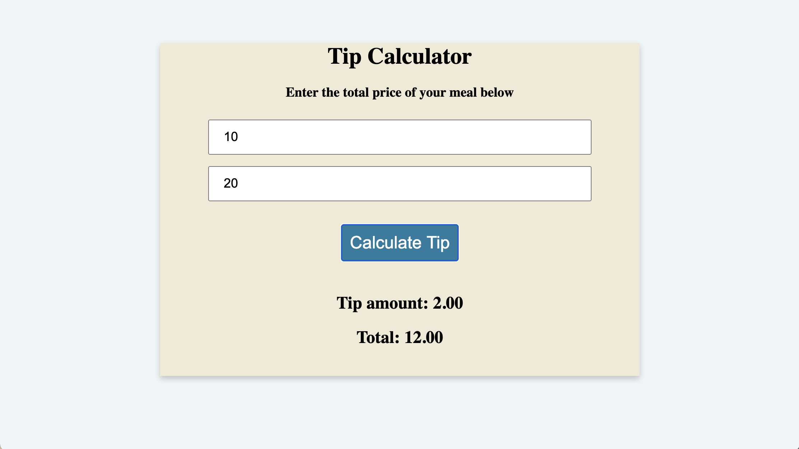

# Tip-Calculator

## Discription 

Users should be able to see the calculated tip amount and total on the screen after clicking on the submit button

## Expected Behavior

When a user enters numbers in the text fields and clicks on the Calculate Tip button, calculated totals for both the tip amount and total should appear on screen.  

## Link To Deployed Page 

## Mock-up

The following image demonstrates the web application's appearance and functionality:

